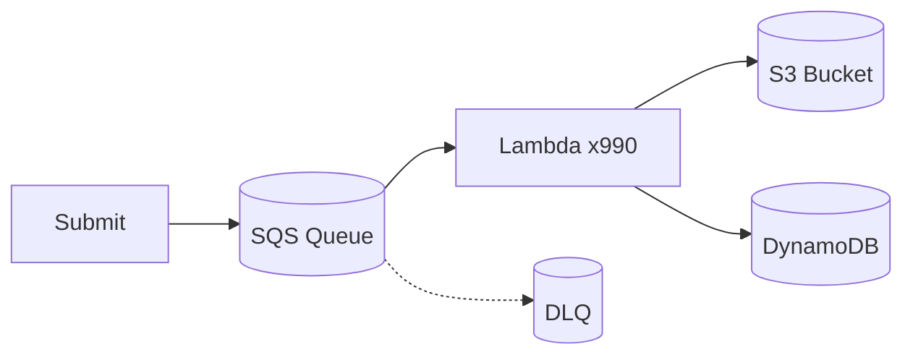

<p align="center">
  
</p>

<h1 align="center">Video-Reason</h1>

<p align="center">
  <b>Can video generation models reason?</b><br>
  We build open-source tools to generate, evaluate, and understand reasoning in video models.
</p>

<p align="center">
  <a href="https://video-reason.com/">Website</a> &middot;
  <a href="https://video-reason.github.io/Awesome-Video-Reasoning/">Paper List</a> &middot;
  <a href="#citation">Paper</a>
</p>

<p align="center">
  
  
  
  
  
</p>

---

**Very Big Video Reasoning (VBVR)** is a research initiative investigating whether video generation models can perform genuine reasoning — solving chess puzzles, navigating mazes, completing Sudoku, mental rotation, and Raven's matrices — purely through visual generation.

Our suite spans the full pipeline: **data generation** at scale, **unified inference** across 37 commercial and open-source video models, and **deterministic evaluation** with 100+ rule-based benchmarks. All tools are open-source under Apache 2.0.

---

## Repositories

### [VBVR-EvalKit](https://github.com/Video-Reason/VBVR-EvalKit) — Evaluation Toolkit

Unified inference and evaluation across **37 video generation models**.

| | |
|---|---|
| **Commercial APIs** | Luma Dream Machine, Google Veo, Kling AI, OpenAI Sora, Runway ML |
| **Open-Source** | LTX-Video, HunyuanVideo, WAN, CogVideoX, SVD, DynamiCrafter, and more |
| **VBVR-Bench** | 100+ rule-based evaluators with deterministic 0–1 scores, no API calls needed |
| **Task Categories** | Abstraction, Categorization, Navigation, Perception, Physics, Transformation |

```bash
pip install -e .
python examples/generate_videos.py --model svd --questions-dir ./data --output-dir ./outputs
python examples/score_videos.py --inference-dir ./outputs
```

---

### [VBVR-DataFactory](https://github.com/Video-Reason/VBVR-DataFactory) — Scalable Data Generation

Distributed data generation system built on **AWS Lambda** with **300+ generators**.

| | |
|---|---|
| **Scale** | Up to 990 concurrent Lambda executions |
| **Generators** | 300+ from the [VBVR-DataFactory](https://github.com/VBVR-DataFactory) org |
| **Deduplication** | DynamoDB-based param-hash dedup across runs |
| **Infrastructure** | One-command deploy with AWS CDK (S3, SQS, Lambda, DynamoDB) |



---

### [Awesome-Video-Reasoning](https://github.com/Video-Reason/Awesome-Video-Reasoning) — Paper Collection

[](https://github.com/sindresorhus/awesome)

A curated list of research papers on **reasoning with video generation models** — covering visual reasoning, world modeling, spatial memory, chain-of-thought video generation, physics-aware generation, and evaluation benchmarks.

Browse the full list at [video-reason.github.io/Awesome-Video-Reasoning](https://video-reason.github.io/Awesome-Video-Reasoning/).

---

## How It All Fits Together

```
┌─────────────────────────────────────────────────────────┐
│                     VBVR Pipeline                       │
│                                                         │
│  1. GENERATE        2. INFER           3. EVALUATE      │
│  ┌──────────────┐   ┌──────────────┐   ┌────────────┐  │
│  │ DataFactory   │──▶│  EvalKit     │──▶│ VBVR-Bench │  │
│  │ 300+ tasks    │   │  37 models   │   │ 100+ rules │  │
│  │ AWS Lambda    │   │  Unified API │   │ 0–1 scores │  │
│  └──────────────┘   └──────────────┘   └────────────┘  │
│                                                         │
│  Awesome-Video-Reasoning: literature survey & tracking  │
└─────────────────────────────────────────────────────────┘
```

<table>
<tr>
<td width="33%" align="center"><b>300+</b><br>Data Generators</td>
<td width="33%" align="center"><b>37</b><br>Video Models</td>
<td width="33%" align="center"><b>100+</b><br>Rule-Based Evaluators</td>
</tr>
<tr>
<td width="33%" align="center"><b>6</b><br>Task Categories</td>
<td width="33%" align="center"><b>50+</b><br>Researchers</td>
<td width="33%" align="center"><b>Apache 2.0</b><br>Fully Open Source</td>
</tr>
</table>

---

## Citation

If you use VBVR in your research, please cite:

```bibtex
@article{vbvr2026,
  title   = {A Very Big Video Reasoning Suite},
  author  = {Wang, Maijunxian and Wang, Ruisi and Lin, Juyi and Ji, Ran and
             Wiedemer, Thaddäus and Gao, Qingying and Luo, Dezhi and
             Qian, Yaoyao and Huang, Lianyu and Hong, Zelong and Ge, Jiahui and
             Ma, Qianli and He, Hang and Zhou, Yifan and Guo, Lingzi and
             Mei, Lantao and Li, Jiachen and Xing, Hanwen and Zhao, Tianqi and
             Yu, Fengyuan and Xiao, Weihang and Jiao, Yizheng and
             Hou, Jianheng and Zhang, Danyang and Xu, Pengcheng and
             Zhong, Boyang and Zhao, Zehong and Fang, Gaoyun and Kitaoka, John and
             Xu, Yile and Xu, Hua and Blacutt, Kenton and Nguyen, Tin and
             Song, Siyuan and Sun, Haoran and Wen, Shaoyue and He, Linyang and
             Wang, Runming and Wang, Yanzhi and Yang, Mengyue and Ma, Ziqiao and
             Millière, Raphaël and Shi, Freda and Vasconcelos, Nuno and
             Khashabi, Daniel and Yuille, Alan and Du, Yilun and Liu, Ziming and
             Lin, Dahua and Liu, Ziwei and Kumar, Vikash and Li, Yijiang and
             Yang, Lei and Cai, Zhongang and Deng, Hokin},
  year    = {2026}
}
```

---

<p align="center">
  <a href="https://video-reason.com/">video-reason.com</a>
</p>
